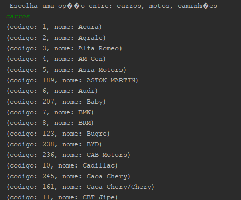
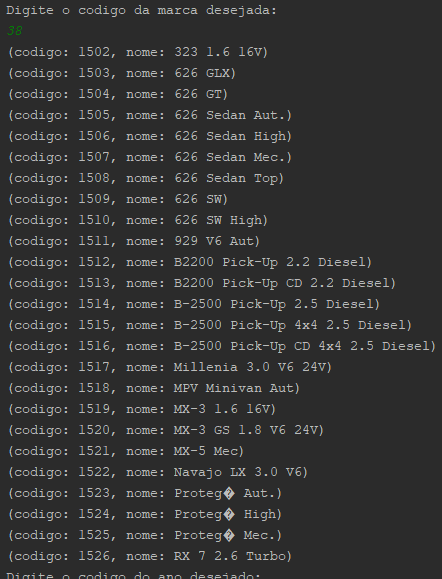
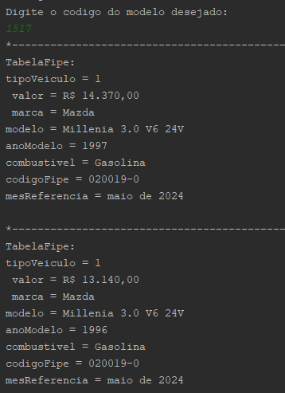

 
# Desafio: consultando avaliações de veículos

Consumir essa API e conseguir ver, baseado em um carro que você escolher, quais são os preços baseados no ano.

## 🔨 Funcionalidades do projeto

Indique quais são as funcionalidades e comportamentos do App

Se possível, apresente um exemplo visual do projeto, seja gif, imagens ou vídeo, abaixo segue um exemplo:

## ✔️ Técnicas e tecnologias utilizadas

**Faça uma lista de tecnologias e técnicas utilizadas (a justificativa e descrição são opcionais)**:

- `Funcionalidade 1`: Visualização das marcas do automóvel escolhido (carros, motos ou caminhoes).
- `Funcionalidade 2`: Visualização do carro escolhido (Escolha realizado pelo codigo). 
  - `Funcionalidade 3`: Visualização dos modelos disponíveis.
- `Funcionalidade 4`: Visualização de todas as tabelas disponíveis para o modelo.

Exemplo: 

Usuário insere "carros":

Usuário insere codigo da marca "38" (mazda):

Usuário digita o codigo do modelo desejado (exemplo: 1517):

## 📁 Acesso ao projeto

O projeto está disponível em: [repositorio](https://github.com/matheusfy/TabelaFipe)

## 🛠️ Abrir e rodar o projeto

Realize o clone do repositório o seu computador para executar o projeto

## 📚 Mais informações do curso

Este é um projeto final de um dos módulos de especialização em backend com java oferecida pela Alura em parceria com a Oracle.
